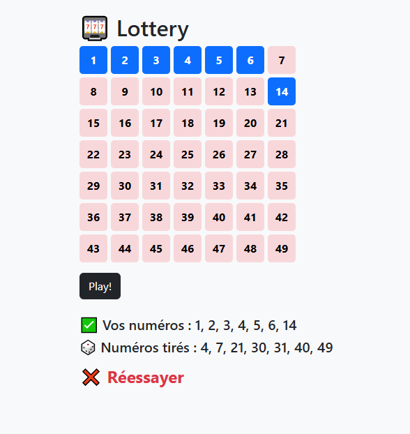

<p align="center">
  
</p>


# 🎱 Loterie Interactive - Application PHP

<p align="center">
   
</p>


  

*Une application web de simulation de loterie avec interface simple et résultats en temps réel, développée en PHP natif sans frameworks.

  

## ✨ Fonctionnalités

  

- **🎯 Sélection intuitive** : Interface conviviale pour choisir vos numéros

- **🎲 Tirage aléatoire** : Génération automatique de numéros gagnants

- **📊 Résultats instantanés** : Vérification immédiate des correspondances

- **📱 Responsive design** : Fonctionne sur tous les appareils

- **🔄 Architecture modulaire** : Code organisé et maintenable

  

## 🛠️ Technologies

  

- **PHP 7.4+** - Backend natif sans frameworks

- **HTML5** - Structure sémantique

- **CSS3** - Styles modernes

- **JavaScript** - Interactions client (optionnel)

  

## 📁 Structure du Projet

  
``` bash
lottery-php/
├── index.php # Point d'entrée principal
├── includes/
│ ├── header.php # En-tête HTML
│ ├── footer.php # Pied de page
│ ├── form.php # Formulaire de sélection
│ ├── functions.php # Logique métier
│ └── styles.css # Feuille de style
└── README.md
```

  

## 🚀 Installation Rapide

  

### 1. Cloner le projet

```bash

git clone https://github.com/votre-username/lottery-php.git

cd lottery-php
```
### 2. Lancer le serveur local

```bash
php -S localhost:8000
```


### 3. Ouvrir dans le navigateur

```bash
http://localhost:8000
```

###  4. 🎮 Comment Jouer

- Sélectionnez vos numéros via l'interface

  

- Cliquez sur le bouton "Vérifier"

  

- Consultez le tirage aléatoire généré

  

- Découvrez si vous avez gagné

  


### 5. 📦 Dépendances

- Aucune dépendance externe requise

  

- PHP 7.4 ou supérieur

  

- Serveur web (Apache, Nginx) ou PHP CLI

  

- Navigateur web moderne

  


### 7. 🤝 Contribution

Les contributions sont bienvenues !

  

- Fork le projet

  

- Crée une branche : git checkout -b feature/nouvelle-fonctionnalite

  

- Commit : git commit -m "Ajout de..."

  

- Push : git push origin feature/nouvelle-fonctionnalite

  

- Ouvre une Pull Request

  

📄 Licence

Ce projet est sous licence MIT – voir le fichier LICENSE.

  

👨‍💻 Auteur

Développé par Ayoub Aguezar pour l’apprentissage de PHP.


  


  

⭐ N’oubliez pas de star le repo si le projet vous a été utile !
